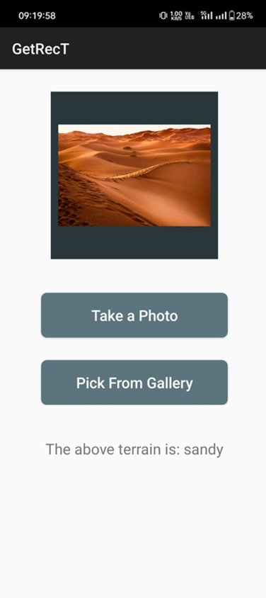
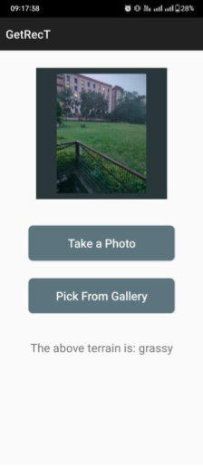

# Deep Learning for Terrain Recognition

## Team Details
- **Ministry of Defence PS Code:** 1418
- **Problem Statement Title:** Deep learning for terrain recognition
- **Team Name:** SIH-2023/22
- **Team Leader Name:** Aman Anand
- **Institute Code (AISHE):** U-0205
- **Institute Name:** Indian Institute of Technology (Indian School of Mines) Dhanbad
- **Theme Name:** Miscellaneous

## Problem Statement
Develop a solution for terrain recognition using deep learning techniques to classify and analyze terrain images.

## Approach

### Solution
We employ transfer learning to generate a feature map encoding of the given terrain image. This feature map is further classified using fully connected dense layers, resulting in probabilistic predictions. After experimenting with various deep learning models, we found ResNet50 to be the most effective for feature map generation.

The trained model is integrated into an application to enable real-time detection of terrains from both camera input and stored images.

## Tech Stack
- **Python:** Preferred programming language for deep learning.
- **OpenCV:** Open source library for image preprocessing.
- **TensorFlow:** Widely used framework for deep learning research and development.
- **Keras:** Neural network API that runs on top of TensorFlow.
- **Numpy:** Library for fast computation and data processing using GPUs.
- **Android Studio:** IDE for Android app development.
- **Kotlin:** Backend language for Android development.
- **XML:** For designing the frontend of the Android app.

## Applications
Our solution has versatile applications, including:
- Autonomous drones for identifying suitable farming locations.
- Urban development planning.
- Defence and security operations.
- Prediction of water availability in specific areas.
- Determining the most suitable mode of transport based on terrain.

## Installation and Usage

### Prerequisites
- Python 3.x
- TensorFlow
- Keras
- OpenCV
- Numpy
- Android Studio

### Setup
1. Clone the repository:
   ```bash
   git clone <repository-url>
   cd <repository-directory>
## User-Interface
Here is some screenshots of our application:
 
 

.png)
